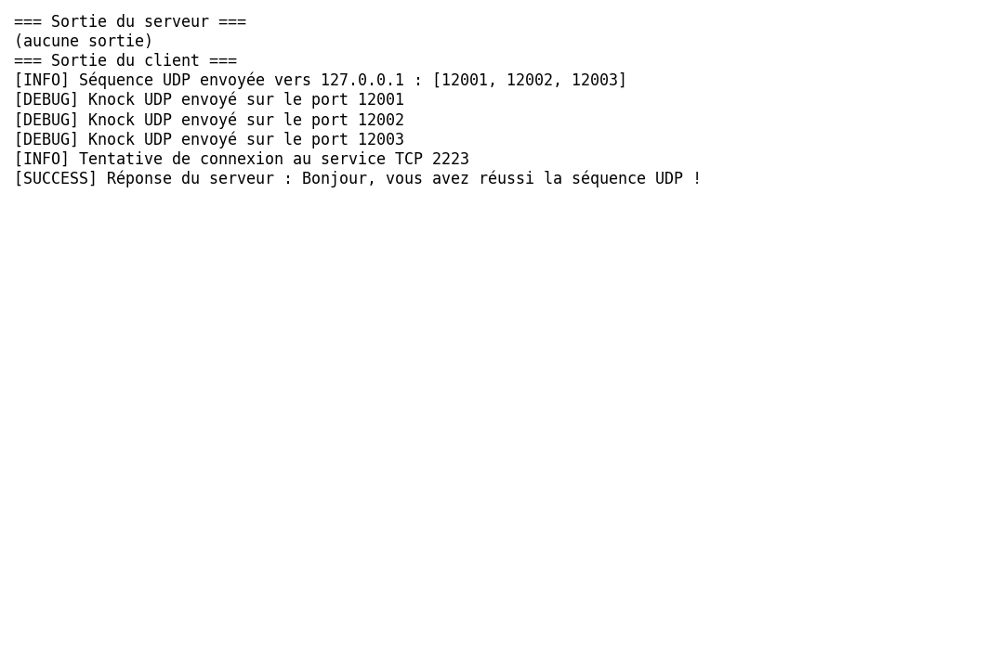

## POC 2 : Port-Knocking via UDP

Dans cette deuxième preuve de concept, l’utilisation du protocole **UDP** pour la phase de knocking est explorée. L’avantage principal est de réduire l’empreinte réseau (pas de handshake TCP) et de démontrer qu’il est possible de surveiller des paquets UDP aussi efficacement que des connexions TCP.

Le serveur `udp_knock_server.py` écoute sur trois ports UDP : **12001**, **12002**, et **12003**. À chaque datagramme reçu, il vérifie si l’adresse IP suit l’ordre attendu. Lorsqu’il détecte la séquence complète, il ouvre un port TCP (**2223**) pour accueillir le client :

```python
class UDPKnockServer:
    def __init__(self, sequence: List[int], service_port: int, seq_timeout: float = 5.0, service_timeout: float = 30.0):
        self.sequence = sequence
        self.service_port = service_port
        self.seq_timeout = seq_timeout
        self.service_timeout = service_timeout
        self.states: Dict[str, Tuple[int, float]] = {}
        # ...

    def _listen_knock(self, sock: socket.socket, port_index: int) -> None:
        data, addr = sock.recvfrom(1024)
        client_ip, _ = addr
        # Mise à jour de l'état et vérification de la séquence
        # Ouverture du service TCP en cas de succès
```

Le client `udp_knock_client.py` envoie simplement des datagrammes UDP vers les ports de la séquence, puis tente de se connecter au service TCP pour obtenir un message de bienvenue. La séquence et le port de service peuvent être passés en argument sur la ligne de commande.

En pratique, le déroulement est le suivant : le serveur est lancé, puis le client. La capture ci-dessous montre que le serveur a bien reçu les frappes UDP et a ouvert le port de service, tandis que le client affiche :

> Réponse du serveur : Bonjour, vous avez réussi la séquence UDP !



Cette variante démontre qu’il est possible de réaliser du port-knocking avec un protocole sans connexion, moyennant une légère adaptation du serveur.
